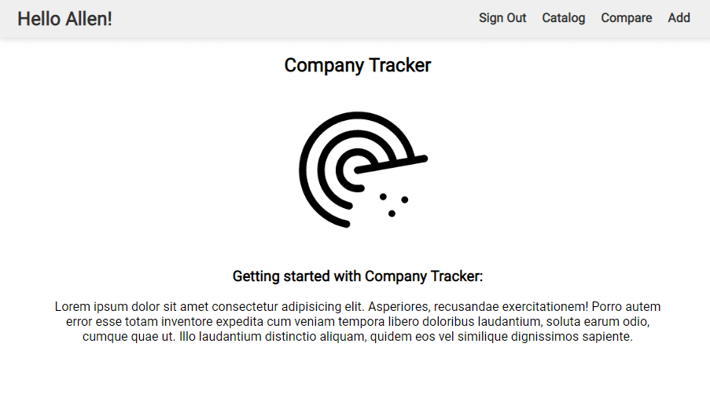

# Company Tracker
### v1.0.0

#### GitHub: https://github.com/allenjwelch/company_tracker
#### Heroku: https://company-tracker-v1.herokuapp.com/

## Description:
CRUD application for tracking potential companies and clients. 

Features:
- Sign In: Currently only temporarily records user name. Able to be expanded to include password, tokens, and record keeping of active users. 
- Catalog View: Collapsible list of all data. 
- Compare View: Sorted grid of selected sort criteria
- Add, Edit, & Delete

## Prerequisites / Dependencies
To duplicate you will need the following things properly installed on your computer.
* [Git](http://git-scm.com/)
* [Express.js](https://expressjs.com/)
* [React.js](https://reactjs.org/)
* [Node.js](http://nodejs.org/)
  - body-parser

## Installation
* `git clone <repository-url>` this repository
* change into the new directory
* `npm install`

## Running / Development
* npm start (to start development server)
